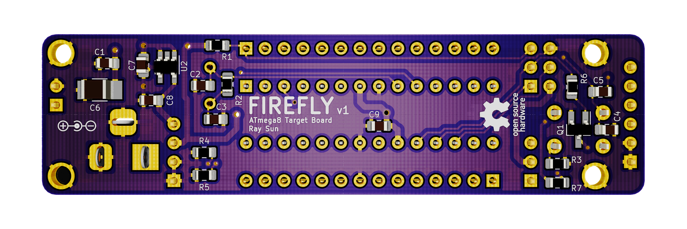

# FireFly
Open source ATmega8 target board with voltage regulation and ICSP, FTDI breakouts.

## Description
FIREFLY is an open-source ATmega8 (ATmega328) target board that might be likened to a lightweight yet accessible Arduino Uno R3. It is intended to be used for learning AVR C/C++ or AVR Assembly with Atmel Studio. A 16 MHz oscillator and reset circuit is provided for a complete microcontroller system. 5V and 3V3 power are created from DC input. The 28 pins of the ATmega8 DIP package are brought out onto breadboard-compatible headers so that the whole board may be plugged directly into a breadboard and used.

The ATmega8 may be programmed through the onboard ICSP or FTDI headers with an appropriate programmer. The power source for the target may be selected by a jumper shunt; when programming, take care not to power the target through the DC input (VIN) in addition to the programmer.

Designed with KiCad EDA 5.0.0. Gerber and drill files for fabrication may be found in `/gerber`, while documentation in pdf format may be found in `/pdf`. 

## Author
- Ray Sun - Undergraduate, Electrical Engineering, Caltech, Class of 2020

I created this board to help me enhance my knowledge of embedded systems development and working with AVRs.

## Licensing
 This work is licensed under a <a rel="license" href="http://creativecommons.org/licenses/by-sa/3.0/">Creative Commons Attribution-ShareAlike 3.0 Unported License</a>.

This design is a derivative of the [Arduino Uno Rev3](https://store.arduino.cc/usa/arduino-uno-rev3) board and is inspired by Adafruit Industries' [DC Boarduino](https://www.adafruit.com/product/72) by Limor Fried. Arduino is a trademark of Arduino AG. This design is not affiliated with Arduino AG. 
